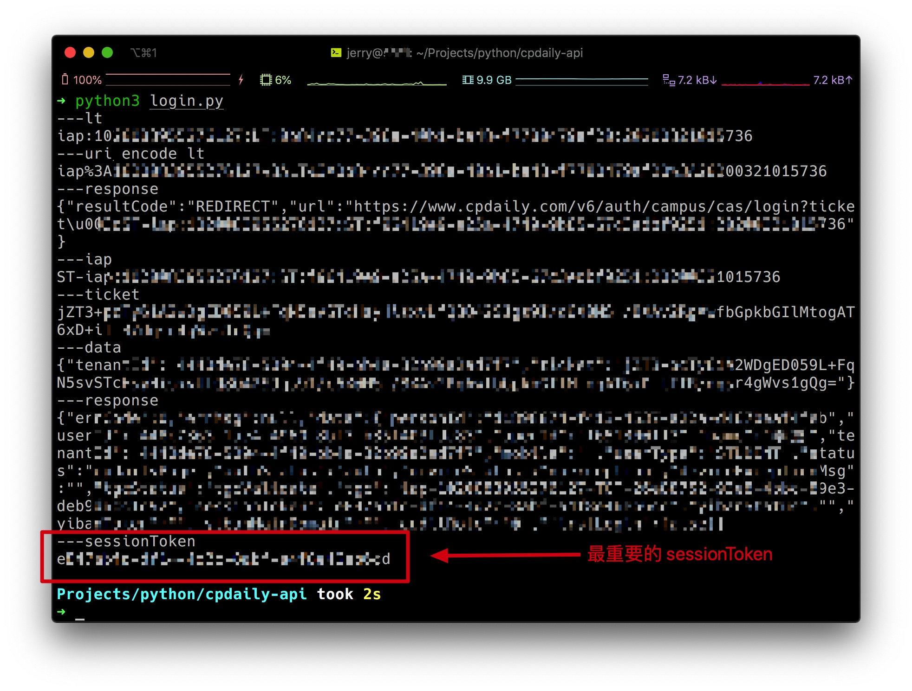
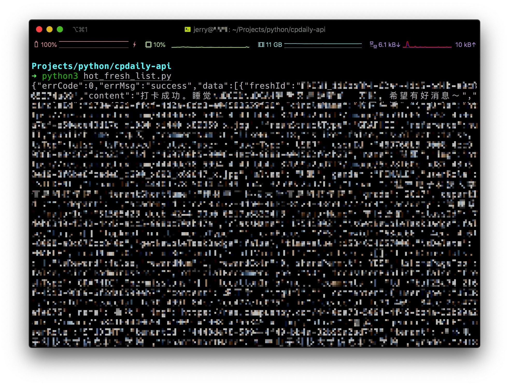

# 今日校园/辅导猫 API

**⚠️注意：本项目仅供学习交流使用，如作他用所承受的任何直接、间接法律责任一概与作者无关（下载使用即代表你同意上述观点）**

若无意侵犯到您的权益，请立即联系我删除相关内容

# 接口列表

* 登录接口 - `login.py`
* 同学列表接口 - `find_student.py`
* 同学圈动态接口 - `fresh_list.py`
* 同学圈热门动态接口 - `hot_fresh_list.py`
* 今日红人榜接口 - `hot_list.py`
* 其他接口随缘更新 🛏️💤

# 依赖库

* bs4
* pydes
* requests

# 登录接口使用说明

首先打开 `cpdaily_info_gen.py`，按照注释的说明将你的手机的 `device_id` 填好

然后单独运行 `cpdaily_info_gen.py` 文件，得到编码后的设备信息

然后请打开 `config.py` 按照顺序依次操作

其中学校的参数可以 [在这里](https://www.cpdaily.com/v6/config/guest/tenant/list) 获取

或者参考项目中的 `tenant_list.json` 也行，但不保证是最新的

登录成功，拿到 sessionToken 后

将 `config.py` 的 sessionToken 填好，其他的接口就能用了（应该

# Screenshot

打码是因为敏感信息太多，看个意思就行了

## 登录

## 同学圈热门动态

